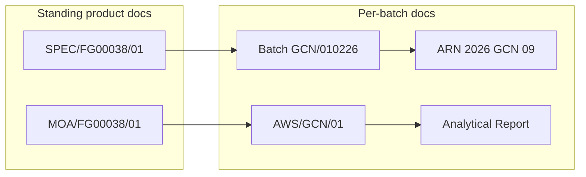

# Downstream Flows Audit — Glycine IP (Completed)

**Date:** June 2026  
**Scope:** Compare AC-QMS downstream document flows (SPEC/MOA/AWS/COA — numbering, COA structure, formulas, AWS fields) against real Aditya Chemicals Glycine IP documents. **Audit only — no code changes.** Test-parameter content (~18 tests) is **MASTER-DEPENDENT** and deferred to the Product Master.

**Severity key:**

| Label | Meaning |
|---|---|
| **STRUCTURAL** | Schema/flow cannot represent something real |
| **DISPLAY** | Rendering / wording only (Epic 21 PDF) |
| **CLIENT-DECISION** | Legacy fidelity vs clean redesign — client must choose |
| **MASTER-DEPENDENT** | Resolved when Product Master + seed align |

## Sources

| File | Role |
|---|---|
| [Spec Glycine IP.docx](../Spec%20Glycine%20IP.docx) | SPEC `SPEC/FG00038/01` Rev 02 |
| [MOA Glycine IP.docx](../MOA%20Glycine%20IP.docx) | MOA `MOA/FG00038/01` |
| [GLYCINE IP.docx](../GLYCINE%20IP.docx) | Full AWS worksheet (`AWS/GCN/01`) |
| [Glycine IP 010326.docx](../Glycine%20IP%20010326.docx) | Short Analytical Report / COA, batch `GCN/010326` |
| [glycine_ip_groundtruth_reference.doc](../glycine_ip_groundtruth_reference.doc) | Structured reconciliation checklist |

**Document mapping:** `Glycine IP 010326.docx` is the customer-facing Analytical Report (COA summary). `GLYCINE IP.docx` is the filled AWS protocol with per-section procedures and `AWS/GCN/01` revision history.



---

## GAP 1 — Document numbering (FG vs GCN dual-code) — CONFIRMED

**Severity:** STRUCTURAL + CLIENT-DECISION  
**Master-dependent?** No  
**Action:** [Client questionnaire](../client-questionnaire.md) — do not change code until answered

| Doc | Real | Code today |
|---|---|---|
| SPEC (standing) | `SPEC/FG00038/01` + `(R-02)` | Template: `SPEC-TPL/GLC/GEN/001`; batch SPEC: `SPEC/GLC/B-2026-001` |
| MOA (standing) | `MOA/FG00038/01` | `MOA/GLC/B-2026-001` |
| AWS | `AWS/GCN/01` (sequence, not batch no) | `AWS/GLC/B-2026-001` |
| COA | Analytical Report; batch `GCN/010226` | `COA/GLC/B-2026-001` |
| ARN / A.R. No. | `2026 GCN 09` | `AR-2026-001` |
| Batch no. | `GCN/010226` | `B-2026-001` |
| Product code | `FG00038` (SPEC/MOA) vs `GCN` (batch family) | Single `products.code = GLC` |

**Three real differences:**

1. SPEC/MOA numbers are **product/revision standing** (`FG00038/01`), not per-batch.
2. **Two code systems** coexist — FG finished-goods code vs GCN batch-family code.
3. AWS uses a **short protocol sequence** (`/01`), not the batch number.

The system produces valid, internally consistent numbers. Legacy replication is a **client decision**, not a defect.

---

## GAP 2 — COA verdict wording — CONFIRMED

**Severity:** DISPLAY  
**Action:** Epic 21 PDF render ([epic-21-pdf-display.md](../epics/epic-21-pdf-display.md))

- Code: `CoaComplianceVerdict` enum `COMPLIES` / `DOES_NOT_COMPLY`
- Real short COA: *"Complies with the IP specification"*
- Real full AWS summary: *"complies / does not comply as per IP specification"*

Enum is correct source of truth; human-readable phrase is a rendering concern.

---

## GAP 3 — Acceptance-limit formatting (BETWEEN) — CONFIRMED

**Severity:** DISPLAY  
**Action:** Epic 21 / trivial formatter align

- Code: BETWEEN → `Between 5.9 and 6.3`
- Real: `5.9 to 6.3`, `98.5% to 101.5%` (tight `%`)
- NMT/NLT already match (`NMT 100 ppm`, etc.)

**Related MASTER-DEPENDENT:** Seed pH `5.5–7.0` and Assay `NLT 98.5%` disagree with real SPEC — placeholder Master content, not COA-generator logic.

---

## GAP 4 — COA generator structure — NO GAP

**Action:** Keep as-is

Row shape (testName / result / acceptanceLimits / conclusion / sortOrder), verdict logic (all SATISFACTORY-or-PASS ⇒ COMPLIES), and signature lineage copied from signed AWS match the real Analytical Report.

---

## GAP 5 — AWS section fields — MOSTLY SOUND

Compared real AWS (`GLYCINE IP.docx`) to `AwsSection` schema.

### Covered well

| Real AWS field | AC-QMS |
|---|---|
| Per-section observations | `observations` JSON |
| Analyzed By / Checked By | `analyzedById` / `checkedById` + complete/check workflow |
| Conclusion Satisfactory / Not satisfactory | `Conclusion` enum |
| Reagents (ID, prep, use-before) | `reagentsUsed` + `Reagent` master + expiry ack |
| Instrument calibration / use-before | `instrumentId` → `Instrument` + `instrumentExpiredAck` |
| OOS + expiry blocks | `oosDetected`, `oosAcknowledged`, ack flows |
| IR attachments | `FileAttachment` on `AwsSection` |
| Sections from signed SPEC | `aws-skeleton-create.service.ts` |

### GAP 5a — Multiple instruments per section

**Severity:** STRUCTURAL (minor) | **Action:** Client decision / future schema

Real IR block lists **Balance ID** and **FTIR ID**, each with calibration dates. Schema allows **one** `instrumentId` per section.

### GAP 5b — Balance ID layout

**Severity:** DISPLAY + CLIENT-DECISION | **Action:** Epic 21

### GAP 5c — AWS header metadata (TRS, received/testing dates)

**Severity:** DISPLAY | **Action:** Epic 21 batch/doc header

### GAP 5d — MOA procedure text embedded on AWS pages

**Severity:** MASTER-DEPENDENT + DISPLAY | **Action:** Master content + PDF composition

---

## GAP 6 — Formula engine (Assay + LOD cross-reference) — STRUCTURAL

**Action:** [Formula cross-section design](../designs/formula-cross-section-references.md) — future epic

Real MOA formula:

```
% Assay (on dried basis) = ((Vs − Vb) × M × F × 100 × 100) / (0.1 × W × (100 − %LOD))
```

- F = 0.00751; **%LOD** from Loss on Drying (prior section)
- Engine supports multi-step formulas **within** one section only — no cross-section refs
- Seed Assay formula is a placeholder and omits `(100 − %LOD)`

| Question | Answer |
|---|---|
| Express math if LOD typed manually into Assay? | Yes — workaround; breaks traceability |
| Auto-pull LOD from completed LOD section? | **No** — structural gap |

LOD and Sulphated ash within-section formulas are expressible today.

---

## Additional findings

| Item | Severity | Notes |
|---|---|---|
| Shelf life 60 mo vs seed 24 mo | MASTER-DEPENDENT / CLIENT | Real batch Mfg Mar 2026 → Exp Feb 2031 |
| Identification A/B sub-tests | MASTER-DEPENDENT | Real splits IR vs chemical; seed collapses |
| Elemental limits SPEC vs AWS/COA | MASTER-DEPENDENT | Per-element ICH Q3D limits on AWS/COA are authoritative |
| Optional tests (Sieve, Bulk/Tapped density) | Validates architecture | Maps to `is_optional` |
| Outside-lab (OVI, Ethylene oxide) | MASTER-DEPENDENT | `isOutsideLab` exists |
| CC numbering `CC/YYYY/NNN` | CLIENT-DECISION (Epic 27) | See questionnaire |
| COA per-row conclusion label | DISPLAY | AWS "Satisfactory" vs short COA "Complies" |

---

## Final summary

| Gap | Severity | Master-dependent? | Action |
|---|---|---|---|
| 1. FG/GCN dual-code numbering | STRUCTURAL + CLIENT | No | Client questionnaire |
| 2. Verdict wording | DISPLAY | No | Epic 21 |
| 3. BETWEEN phrasing | DISPLAY | No | Epic 21 |
| 4. COA generator structure | None | No | Keep as-is |
| 5a. Multiple instruments/section | STRUCTURAL (minor) | No | Client / future schema |
| 5b. Balance ID layout | DISPLAY + CLIENT | No | Epic 21 |
| 5c. AWS header dates/TRS | DISPLAY | No | Epic 21 |
| 5d. MOA text on AWS pages | MASTER + DISPLAY | Partly | Master + PDF |
| 6. Assay `%LOD` cross-section | STRUCTURAL | Formula defs: yes | Formula-engine epic |
| Seed 4-test vs ~18 tests | MASTER-DEPENDENT | Yes | [Master reconciliation](../checklists/glycine-master-reconciliation.md) |

## Net conclusion

Downstream flows are in good shape for Epic 12c. COA auto-generator logic is sound. Only structural items before heavy Master import:

1. **Numbering** — legacy FG/GCN dual-code vs uniform scheme (client questionnaire).
2. **Formula engine** — cross-section reference for Assay-on-dried-basis.

Everything else is DISPLAY (Epic 21), MASTER-DEPENDENT, or minor AWS paper-fidelity choices.

**No code changes recommended from this audit.**
