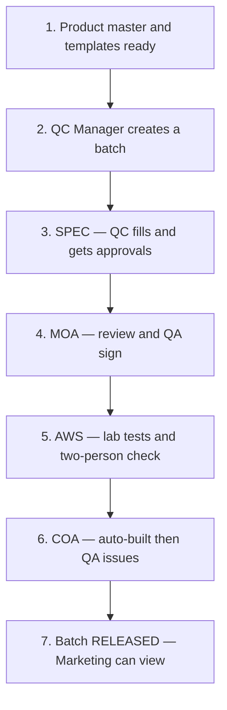

# How AC-QMS Works — Plain Language Guide

This document explains what the **API Gateway** (the backend brain of AC-QMS) does, who does what, and how a batch moves from start to release — without technical jargon.

For technical details, see [ARCHITECTURE.md](../ARCHITECTURE.md).

---

## What is this system?

AC-QMS helps Aditya Chemicals manage **quality control paperwork** for pharmaceutical products. When a new batch of material is made, the system tracks four main documents through review and approval:

| Short name | Full name | What it is |
|------------|-----------|------------|
| **SPEC** | Product Specification (batch copy) | The tests and limits that apply to *this batch* |
| **MOA** | Method of Analysis | How each test is performed (procedures) |
| **AWS** | Analytical Work Sheet | Where lab staff record actual test results |
| **COA** | Certificate of Analysis | The final report sent to customers — built from AWS results |

Everything is logged. Every submit, approve, sign, and reject is recorded for audit.

---

## Who is involved?

| Role | Department | Main job in the system |
|------|------------|------------------------|
| **QC Executive** | Quality Control | Does lab work, fills in AWS, submits documents |
| **QC Manager** | Quality Control | Reviews and approves work from QC Executives |
| **QA Manager** | Quality Assurance | Final sign-off on MOA, AWS; issues the COA |
| **Marketing Executive** | Marketing | Read-only access to **released** batches and issued COAs |

**Two-person rule:** The same person cannot both do the lab work and verify it on AWS. A different QC Executive must check the analyst’s entries.

---

## The big picture — one batch’s journey



Think of it like a **production line**: each document must pass its gates before the next one opens.

---

## Step by step

### 1. Before any batch — product setup (one-time per product)

Someone sets up the **product master**: product name, tests, limits, formulas, and MOA procedures. From that, the system keeps **templates** for future batches.

*You do this once per product (e.g. Glycine IP), not for every batch.*

---

### 2. A new batch is created

A **QC Manager** creates a batch and assigns a **QC Executive** to work on it.

The system automatically creates **four document placeholders** for that batch:

- SPEC  
- MOA  
- AWS  
- COA  

They start as **waiting** — not active yet. The batch’s “current step” tracks where you are in the line.

---

### 3. SPEC — “What are we testing on this batch?”

**Who:** Assigned QC Executive (with QC Manager and QA Manager approvals)

**What happens:**

1. QC Executive creates the batch SPEC from the approved template (chooses which tests apply).
2. They submit it for review.
3. QC Manager approves (must be a different person than the submitter).
4. QA Manager signs.

**When SPEC is signed**, the system automatically:

- Builds the **MOA** for this batch (copies procedure sections from the product master).
- Moves the batch to the MOA step.

---

### 4. MOA — “How do we run each test?”

**Who:** Same approval chain — QC Executive → QC Manager → QA Manager

**What happens:**

- MOA is **review only** — procedures were copied from the master when SPEC was signed.
- Team reads, submits, approves, and QA signs.

**When MOA is signed**, the system automatically:

- Opens the **AWS** (Analytical Work Sheet).
- Creates one **section per test** from the batch SPEC (empty rows ready for lab data).
- Notifies QA that AWS is ready.

---

### 5. AWS — “What did the lab actually find?”

**Who:** QC Executive (analyst) enters data; a **different** QC Executive (checker) verifies each section

**What happens:**

1. Analyst enters observations (weights, readings, instrument used, etc.).
2. The **system calculates results** from formulas — staff cannot type over the calculated answer.
3. The system compares results to the limits frozen from SPEC and marks pass/fail.
4. If a result is **out of spec (OOS)**, the analyst must acknowledge it before continuing.
5. If an instrument or reagent is **past its use-by date**, that must be acknowledged too.
6. Analyst marks a section complete → checker (another QC Executive) verifies it.
7. When **every section is complete**, the AWS document can be submitted.

**Approval chain:**

| Step | Who | Action |
|------|-----|--------|
| Submit | QC Executive | All sections must be complete |
| Approve | QC Manager | Cannot be the same person who submitted |
| Sign | QA Manager | Cannot be the same person who QC-approved |

**When AWS is signed**, the system automatically:

- Builds the **COA** from all completed AWS sections (test name, result, limit, pass/fail).
- Sets overall verdict: **Complies** or **Does not comply**.
- Moves the batch to the COA step.
- Notifies QA that COA is ready for final issue.

---

### 6. COA — “Official certificate for the customer”

**Who:** QA Manager only

**What happens:**

- COA is **not written by hand** — it is **auto-generated** when AWS is signed.
- QA Manager reviews the generated COA and performs **Sign & Issue** (with password).
- That is the **final step** for this batch.

**When COA is issued:**

- Batch status becomes **RELEASED**.
- Marketing team can see the batch and issued COA (read-only).
- QC and QA get notifications that the batch is released.

---

### 7. After release — Marketing

**Marketing Executives** can:

- List released batches and issued COAs  
- Open batch summaries and COA details  

They **cannot** change anything. Unreleased or in-progress work is hidden from them.

*Downloading a PDF COA is planned (not live yet).*

---

## What the system does for you automatically

| Event | System action |
|-------|----------------|
| Batch created | Creates four document slots (SPEC, MOA, AWS, COA) |
| SPEC signed | Fills MOA from product master |
| MOA signed | Opens AWS with empty test sections |
| Analyst saves AWS data | Recalculates formulas and pass/fail |
| AWS signed | Builds COA from all test results |
| COA issued | Marks batch RELEASED; notifies relevant teams |

You do not re-type limits or results onto the COA — they flow from SPEC → AWS → COA.

---

## Approvals in simple terms

Every important document move needs:

1. The **right role** (e.g. only QC Manager can approve at QC stage).  
2. The **right person** (submitter ≠ approver where rules apply).  
3. **Password confirmation** (electronic signature).  
4. An **audit log entry** (who, when, what changed).

If something is rejected, the document goes back to draft with a comment. On AWS, completed lab sections usually **stay complete** after reject — the team fixes paperwork and re-submits without redoing all lab entry.

---

## Notifications

When something needs attention, the right people get an **in-app notification**, for example:

- Batch assigned to you  
- Document waiting for your approval  
- AWS ready after MOA signed  
- COA ready after AWS signed  
- Batch released  

Email alerts are not part of this phase.

---

## What is not finished yet

| Item | Status |
|------|--------|
| **PDF download** for COA / marketing | Planned — backend creates data today; printable PDF comes in a later phase |
| **Frontend connected to this API** | UI exists separately; wiring them together is the next integration step |
| **Change Control (CC) acknowledgements** | Stub only — not live |

---

## Example — Glycine IP demo batch

The seeded demo batch **B-2026-001** (Glycine IP) walks through this full path so you can test the system end-to-end.

---

## Quick reference — document order

```
Product master (setup)
    ↓
Create batch
    ↓
SPEC  →  submit → QC approve → QA sign
    ↓
MOA   →  submit → QC approve → QA sign
    ↓
AWS   →  lab entry → checker verify → submit → QC approve → QA sign
    ↓
COA   →  auto-generated → QA sign & issue
    ↓
Batch RELEASED  →  Marketing can view
```

---

## Related documents

| Document | Purpose |
|----------|---------|
| [Glycine audit](audits/glycine-downstream-audit.md) | Detailed check against real Glycine paperwork |
| [Client questionnaire](client-questionnaire.md) | Decisions still needed (numbering, wording, etc.) |
| [ARCHITECTURE.md](../ARCHITECTURE.md) | Technical design for developers |
